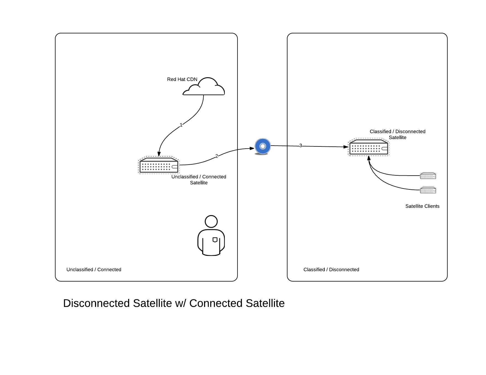
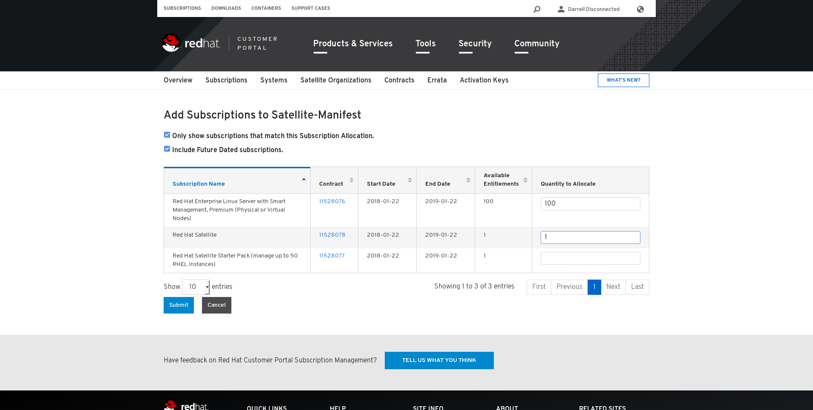
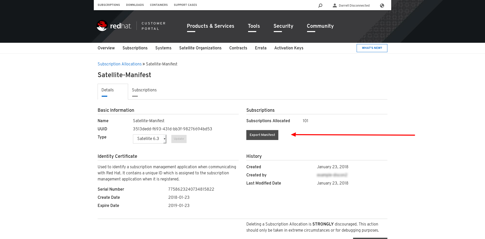

## Overview

This guide provides guidance as to how a user of Red Hat Satellite 6 can setup a Satellite installation to support a disconnected.

## Version Support

This document has been developed on Satellite 6.3 (Beta). It _should_ work with Satellite 6.2 with minor tweaks.

## Intended Audience

You love Satellite and all things Satellite.

## Source Material / Additonal Reading

This document is meant as a supplement to the existing product docs. Content for this guide was sourced from (and inspired by)

- The Arch guide
- The install guide
- The content management guide
- The ISS Knowledge article
- Subscription Manager for the Recovering RHN Addict, part 7

## What is disconnected?

In the scope of Red Hat Satellite, **disconnected** refers to any Satellite which cannot reach **cdn.redhat.com**. Many Satellites are built disconnected because of a number of reasons, including, but not limited to

* Organizational policies which do not allow production systems to connect directly to the internet
* Completely Airgapped systems which cannot connect to the internet at all.

This guide will cover how to

* Plan your disconnected environment from an architectural and subscription perspective
* Installing your first disconnected environment
* Importing content for the first time
* Maintaining the disconnected environment and its content over time.

This document will be written 'case-study' style and is intended to be a cookbook.

## Planning

There are two major mechanisms that can be used to acquire Red Hat content, **Content ISOs** or **Red Hat Satellite Inter-Satellite-Sync**

Content ISOs can be downloaded from the REd Hat Customer Portal (Insert Link). Content ISOs are periodic snapshots of a product's repositories, made on a scheduled basis (usually every quarter give or take). Content ISOs can be downloaded from the customer portal, extracted and used to populate a disconnected Satellite.

In this scenario, the user would

1. download content ISOs from the customer portal (insert Link) to a workstation.
2. burn the content ISOs to CD or DVD.
3. transit those ISOs into their disconnected environment and import it into a Satellite

Alternatively, a user can deploy a Satellite which *is* able to connect to cdn.redhat.com and use that Satellite to export Content suitable for importing into another Satellite which is disconnected.  

In this scenario, the user would
1. synchronize products for which they have a valid subscription for to their internet connected satellite.
2. Export that content using the Inter-Satellite-Sync Feature
3. transit that content to the disconnected Satellite (by either exporting to CD/DVD ISO OR by a disk export)

There are pros & cons to each approach

Method | Pros | Cons
-------- | -------- | --------
Inter Satellite Sync | Can export any/all content which you have a valid subscription for. | Cost (both hardware & subscription) for the internet connected Satellite.
Content ISOs | Do not require an Internet connected Satellite. | Aren't released often. Aren't available for all products.

It is *strongly* recommended to use **Inter Satellite Sync** as it puts the total control over when content is exported/imported in the hands of the user. Content import / export using content ISOs will be covered in an Appendix to this doc.

### Planning Subscriptions & Manifests.

In our first case study, Darrell Disconnected, a systems administrator at Example Corp, wishes to support 2 Satellite servers, one which will be used to support systems in the disonnected environment, and  one which will be internet connected with the intention of using it to export connect. Additionally, Darrell needs to manage 100 Red Hat virtual machines in the disconnected environment.

**Which subscriptions to purchase?**

In this example, Darrell needs to purchase two Satellite server subscriptions (MCT0370), one for each of the connected and disconnected environments respectively. Note: Red Hat Satellite Starter Pack subscriptions (MCT1650) can (and should) be used if the number of managed RHEL systems in each environment is less than 50.

Darrell's account has the following subs:

Subscription | Quantity | Purpose
-------- | -------- | --------
MCT1650 - Red Hat Satellite Starter Pack | 1| Internet Connected Satellite for exporting content.
MCT0370 - Red Hat Satellite | 1 | Disconnected Satellite
RH00008 - Red Hat Enterprise Linux with Smart Management (Physical or VirtualNodes) | 50 | RHEL + Smart Management Subscriptions for the managed Nodes.

Note: As the internet connected Satellite is only being used to sync/export content, Darell opted to get a Satellite Starter Pack, which is lower cost. Also, the RH00008 Subscriptions are example, and indicative of the deploy. Your subscriptions will vary. (It is only the Satellite subscriptions that matter.)

### Changes to the standard installation.

Satellites which will be used to export content have different disk space & partitioning requirements than usual.  Of note are the `/var/cache/pulp` and `/var/lib/pulp/katello-export` directories.

The `/var/cache/pulp` directory is used as transient space for both importing **AND** exporting content. It needs to be sized as large as the largest content export. If exporting content to ISO, this needs to be sized **twice** as large as the largest content export.

Example: If a repository with 40GB in content needs to be exported, `/var/cache/pulp` needs to be 40GB in size. If this same repository is exported to ISO, 80GB is required in `/var/cache/pulp`

The `/var/lib/pulp/katello-export` directory is the final storage location for all exported content. This directory needs to be sized as large as the largest content export. Example: If a repository with 40GB in content needs to be exported, `/var/lib/pulp/katello-export` needs to be 40GB in size.

 This directory can be changed if necessary:

- In the UI, changing the pulp_export_destination option, under Administer->Settings->Katello.
- via Hammer `hammer settings set --name pulp_export_destination --value /var/www/html/pub/exports/``

### Creating Subscription Manifests.

In our example above, Darrell Disconnected has the following subscriptions associated with his account.

Subscription | Quantity | Purpose
-------- | -------- | --------
MCT1650 - Red Hat Satellite Starter Pack | 1| Internet Connected Satellite for exporting content.
MCT0370 - Red Hat Satellite | 1 | Disconnected Satellite
RH00008 - Red Hat Enterprise Linux with Smart Management (Physical or VirtualNodes) | 50 | RHEL + Smart Management Subscriptions for the managed Nodes.

<INSERT IMAGE>

Firstly, we'd head over to the [subscription allocations](https://access.redhat.com/management/subscription_allocations) page to generate a subscription manifest.

We'll add the **Red Hat Satellite** subscriptions and the **Red Hat Enterprise Linux** subscriptions to the allocation, by selecting the **subscriptions** tab -> **add subscriptions**. If you have other subscriptions that you wish to use in the disconnected environment, add those here as well.

Note: we are **NOT** adding the **Red Hat Satellite Starter Pack** subscription.  This will be used by the connected Satellite to register to Red Hat Subscription Management (RHSM) for errata and software.  

Lastly, download the subscription manifest:

### Building the connected Satellite

It is expected that the connected Satellite is built as per the specifications in the Installation Guide, taking into account the _Changes to the standard installation_ section above.

For the purposes of this example, our connected Satellite will be named `connected.example.com`

Firstly, let's register the Satellite to the Customer Portal

~~~
[root@connnected ~]# subscription-manager register
Registering to: subscription.rhsm.redhat.com:443/subscription
Username: [REDACTED]
Password:
The system has been registered with ID: b9da2597-34db-40ca-a400-2c1e9741d846
~~~

Next, find the Satellite Starter pack subscription

~~~
[root@connnected ~]# subscription-manager list --all --available --matches '*Red Hat Satellite Starter Pack*'
+-------------------------------------------+
    Available Subscriptions
+-------------------------------------------+
Subscription Name:   Red Hat Satellite Starter Pack (manage up to 50 RHEL Instances)
Provides:            Red Hat Satellite Capsule Beta
                     Red Hat Software Collections (for RHEL Server)
                     Red Hat Satellite Capsule
                     Red Hat Satellite with Embedded Oracle
                     Red Hat Beta
                     Red Hat Satellite Beta
                     Red Hat Satellite 6 Beta
                     Red Hat Satellite 5 Managed DB Beta
                     Red Hat Enterprise Linux Server
                     Red Hat Enterprise Linux High Availability (for RHEL Server)
                     Red Hat Satellite
                     Red Hat Software Collections Beta (for RHEL Server)
                     Red Hat Satellite 5 Managed DB
                     Red Hat Enterprise Linux Load Balancer (for RHEL Server)
SKU:                 MCT1650
Contract:            11528077
Pool ID:             8a99f98261217cc5016122bc17bd0d5d
Provides Management: Yes
Available:           1
Suggested:           1
Service Level:       Premium
Service Type:        L1-L3
Subscription Type:   Standard
Ends:                01/22/2019
System Type:         Physical
~~~

And attach it:

~~~
[root@connnected ~]# subscription-manager attach --pool=8a99f98261217cc5016122bc17bd0d5d
Successfully attached a subscription for: Red Hat Satellite Starter Pack (manage up to 50 RHEL Instances)
~~~

Next, let's setup our repositories

~~~

subscription-manager repos --disable "*"
subscription-manager repos  \
  --enable=rhel-7-server-rpms \
  --enable=rhel-server-rhscl-7-rpms \
  --enable=rhel-server-7-satellite-6-beta-rpms \
  --enable rhel-7-server-satellite-maintenance-6-rpms
subscription-manager release --unset

~~~

And install the Satellite software and `foreman-maintain`, the Satellite maintenance tool.

~~~
yum clean all
yum makecache
yum install satellite -y
yum install rubygem-foreman_maintain -y
yum update -y
~~~

Next we'll install Satellite, setting our default organization to **RedHat**, default location to **RDU** and default admin password to **redhat** (adjust to your needs)
~~~
satellite-installer --scenario satellite -v \
  --foreman-initial-organization RedHat \
  --foreman-initial-location RDU \
  --foreman-admin-password redhat
~~~

Next, we'll setup our `.bashrc` and hammer config, so that we don't have to provide these parameters on every invocation of the CLI.

~~~
echo "ORG=RedHat" >> ~/.bashrc
echo "LOCATION=RDU" >> ~/.bashrc
echo "DOMAIN=example.com" >> ~/.bashrc
echo "SATELLITE=$(hostname -f)" >> ~/.bashrc
source ~/.bashrc

mkdir ~/.hammer/
cat > ~/.hammer/cli_config.yml<<EOF
:foreman:
    :host: 'https://$(hostname)/'
    :username: 'admin'
    :password: 'redhat'

EOF

~~~

Next, copy the subscription manifest to the Satellite. Then import it:
~~~
hammer subscription upload --organization "$ORG" --file /root/manifest.zip
~~~

Next,we'll update some parameters to make our disconnected workflows a bit easier. Firstly, we need to set our default download policy to `immediate`. This ensures that all of the content needed for our content exports is synchronized prior to our exports. If the policy is set to `on_demand` (Satellite 6.3's default) or `background`, the content export will be delayed until all of the remaining RPMs are downloaded from the CDN. Let's just set this now and get it out of the way. More on download policies can be found in [Satellite 6.2 Feature Overview: Lazy Sync](https://access.redhat.com/articles/2695861)

~~~
hammer settings set --name default_download_policy --value immediate
~~~

Also, for our Satellite `connected.example.com`, we have a dedicated partition `/exports`, which we are using for content exports. We'll need to update Satellite to use this directory:

~~~
hammer settings set --name pulp_export_destination --value /exports/
~~~

And make sure the SELinux contexts and permissions are correct.
~~~
chcon --verbose --recursive --reference /var/lib/pulp/katello-export/ /exports/
chmod --verbose --recursive --reference /var/lib/pulp/katello-export/ /exports/
chown --verbose --recursive --reference /var/lib/pulp/katello-export/ /exports/
~~~
